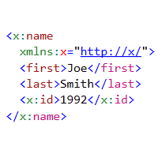

# BetterXml VS2010 Extension

This is a sample extension for Visual Studio 2010 that improves
the XML editing experience.

It currently provides the following features:

1. Highlighting XML closing tags with a format different
from opening tags. Adjust the "XML Closing Tag" classification
 format to configure it.

2. Highlighting XML prefixes on attributes and tags with a new format,
configured using the "XML Prefix" classification format.

Both features are supported on XML and XAML documents.

## Installation

1. Install the Visual Studio 2010 SDK. You'll need it for building custom
   extensions.
2. Open the solution in Visual Studio 2010 and build it.
3. Close all open VS2010 instances.
4. Using Windows Explorer, navigate to the project's output folder and double
   click on the BetterXml.vsix generated.

That's it!
